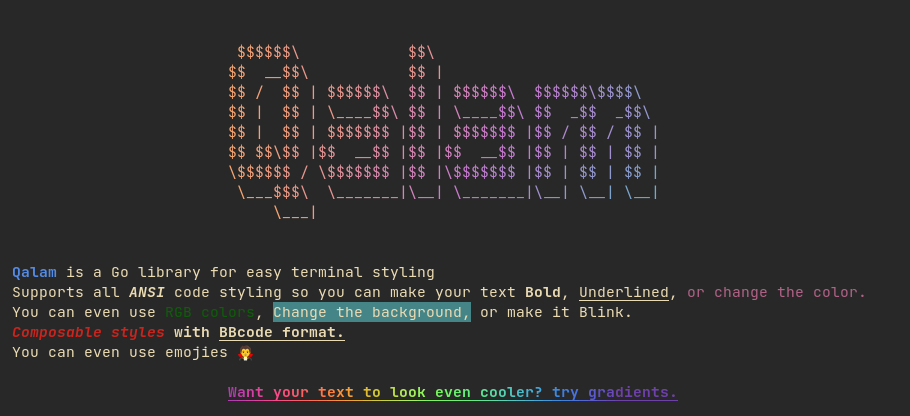

# Qalam ✏️
Qalam is a Go library for easy terminal styling.
 

## Installation
```bash
go get github.com/iskaa02/qalam
```
## Usage
```go
func main(){
	// this will output "a red text" with red in terminal
	// you can use qalam.Sprintf() if you don't want to print yet
	qalam.Printf("[red]a red %s[/red]","text")
}
```
|Code  |Style  |
|--|--|
|b/bold|**bold text**|
|i/italic|*italic text*|
|u/underline|underline text|
|s/strikethrough|~~strikethrough text~~|
|#hexcode|change the color|
|bg#hexcode|change the background color|
|red|change the color to red|
|yellow|change the color to yellow|
|magenta|change the color to magenta|
|white|change the color to white|
|black|change the color to black|
|green|change the color to green|
|cyan|change the color to cyan|
|bg.(color)|change the background color to any color mentioned above|
### Examples
#### Multiple styles

```go
qalam.Printf("[b s]bold and strikethrough[/b s]")
```
outputs:
 ~~**bold and strikethrough**~~
 
#### Composing styles

```go
qalam.Printf("[b]bold only [i]bold and italic[/i][/b]")
```
outputs:
 **bold only** ***bold and italic***
 
#### Emoji
```go
// outputs "this is a vampire -> 🧛"
qalam.Printf("this is a vampire ->[:vampire:]")
```
### Style
You can use style function to apply style to string
```go
// this is equivalent for qalam.Sprintf("[bold]this text is bold[/bold]") 
qalam.Style("this text is bold","bold")
```
### Emoji
You can use get emoji function to return an emoji
```go
// returns '🍎'
qalam.Emoji("red_apple")
```
## Gradients
### Import
```go
import "github.com/iskaa02/qalam/gradient"
```

### Usage
```go
g,err:=gradient.NewGradient("cyan","red")
// if the passed colors are not valid an error is returned
// supports all css valid colors
if err != nil{
}
g.Print("Example gradient from Cyan to Red")
```
outputs the following


For more examples  [checkout this](https://github.com/iskaa02/qalam/blob/main/gradient/README.MD) 

##
### What does the Qalam mean
Qalam in Arabic means pencil

##
### Compatibility 
ANSI work a bit different depending on the operating system,
this implementation should work for MacOS, Linux and Windows, Although it's only been tested on Linux.
