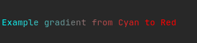
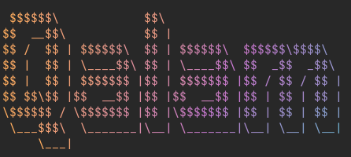
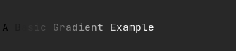
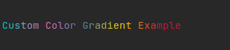
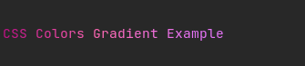
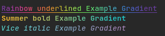

# Gradient
### Installation
```
go get github.com/iskaa02/qalam/gradient
```
### Usage
```go
g,err:=gradient.NewGradient("cyan","red")
// if the passed colors are not valid an error is returned
// supports all css valid colors
if err != nil{
}
g.Print("Example gradient from Cyan to Red")
```
outputs the following


### Methods
- `Apply()`
Apply the gradient without printing

- `Print()`
Apply the gradient and print 

- `Multiline`
Apply the gradient to multi-line string
```go
	g,_ := gradient.
	NewGradient("#FEAC5E", "#C779D0", "#4BC0C8")
	fmt.Println(g.Mutline(`
 $$$$$$\            $$\
$$  __$$\           $$ |
$$ /  $$ | $$$$$$\  $$ | $$$$$$\  $$$$$$\$$$$\
$$ |  $$ | \____$$\ $$ | \____$$\ $$  _$$  _$$\
$$ |  $$ | $$$$$$$ |$$ | $$$$$$$ |$$ / $$ / $$ |
$$ $$\$$ |$$  __$$ |$$ |$$  __$$ |$$ | $$ | $$ |
\$$$$$$ / \$$$$$$$ |$$ |\$$$$$$$ |$$ | $$ | $$ |
 \___$$$\  \_______|\__| \_______|\__| \__| \__|
     \___|
	`))
```


## Gradient Builders
gradient builder enable more customization on the gradients
### Basic
```go
g,_:=gradient.NewGradientBuilder().Build()
g.Print("A Basic Gradient Example")
```


### Custom Colors
`Colors()` method accept anything that implement [color.Color](https://golang.org/pkg/images/color/#Color) interface
```go
g,_:= colorgrad.NewGradient().
    Colors(
        color.RGBA{0, 206, 209, 255},
        color.RGBA{255, 105, 180, 255},
        colorful.Color{R: 0.274, G: 0.5, B: 0.7},
        colorful.Hsv(50, 1, 1),
        colorful.Hsv(348, 0.9, 0.8),
    ).
    Build()
g.Print("Custom Color Gradient Example")    
```


### CSS Colors
`HtmlColors()`  method accepts  [named colors](https://www.w3.org/TR/css-color-4/#named-colors), hexadecimal (`#rgb`,  `#rgba`,  `#rrggbb`,  `#rrggbbaa`),  `rgb()`,  `rgba()`,  `hsl()`,  `hsla()`,  `hwb()`, and  `hsv()`.
```go
g,_:= colorgrad.NewGradient().
    HtmlColors("#C41189", "hotpink", "rgb(90%,45%,97%)").
    Build()
g.Print("CSS colors Gradient Example")
```

### More Styles
`ANSIstyle()` accept any [ansi code](https://github.com/iskaa02/qalam/blob/main/README.MD#usage) 
provided by the qalam package.
```go
g, _ := gradient.NewGradientBuilder().
	HtmlColors("#00DBDE", "#FC00FF").
	ANSIstyle("bold", "underline").
	Build()
g.Print("Gradient Example with Extra styles")
```


### More
- [Domain & Color Position](https://github.com/mazznoer/colorgrad#domain--color-position)
- [Blending Mode](https://github.com/mazznoer/colorgrad#blending-mode)

### Preset Gradients
gradient package ships with Prebuilt gradients
- Rainbow
- Summer
- Vice
```go
// each one of those functions take asni style as parameter
// and returns a gradient
gradient.Rainbow("underline")
.Print("Rainbow Example Gradient\n")
gradient.Summer("bold").
.Print("Summer Example Gradient\n")
gradient.Vice("italic").
Print("Vice Example Gradient")
```

